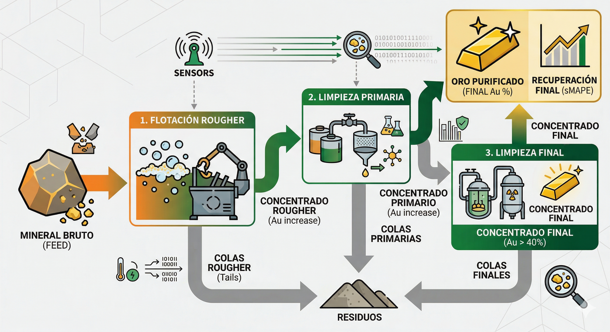

# 🚀 Optimización de Recuperación de Oro - Zyfra

Este proyecto desarrolla un modelo de **Machine Learning** para predecir la recuperación de oro a partir del mineral bruto. El objetivo es optimizar el proceso de purificación multietapa (flotación y limpieza) para la empresa Zyfra, permitiendo identificar parámetros de operación no rentables en tiempo real.

## 🎯 Objetivo
Predecir la eficiencia de recuperación en dos etapas clave:
1. **Rougher (Flotación):** Concentrado inicial.
2. **Final:** Producto terminado tras dos etapas de limpieza.

La métrica principal de evaluación es el **sMAPE final** (Symmetric Mean Absolute Percentage Error).

## 📊 Metodología y Análisis

### 1. Preparación y Validación
* **Consistencia de Datos:** Se validó la fórmula de recuperación manual frente a los datos del dataset ($MAE \approx 0$).
* **Tratamiento de Series Temporales:** Se manejaron valores ausentes mediante el método de *Forward Fill*, considerando que los parámetros industriales cercanos en el tiempo suelen ser similares.

### 2. Análisis del Proceso Químico
* **Evolución de Metales:** El análisis visual confirmó el aumento de la concentración de oro del ~8% al ~45%.
* **Eliminación de Anomalías:** Se identificaron y eliminaron valores atípicos (sumas de concentraciones iguales a cero) que representaban fallos en la instrumentación de la planta.
* **Distribución de Partículas:** Se verificó la similitud entre los sets de entrenamiento y prueba para garantizar la generalización del modelo.

### 3. Modelado Predictivo
Se evaluaron modelos de Regresión Lineal y Random Forest Regressor mediante validación cruzada ($k=5$).
* **Modelo Seleccionado:** Random Forest Regressor.
* **Resultado Final:** sMAPE en el conjunto de prueba de **12.56%**.

## 🛠️ Herramientas Utilizadas
* **Python** (Pandas, NumPy, Scikit-learn)
* **Visualización:** Matplotlib y Seaborn
* **Matemáticas:** Cálculo de métricas personalizadas (sMAPE)

## 💡 Conclusiones Técnicas
El modelo permite a los ingenieros de planta anticipar caídas en la eficiencia y ajustar parámetros de control antes de que ocurran pérdidas económicas. La limpieza de datos orientada al negocio (remoción de ceros por fallos de sensores) fue el factor determinante para la estabilidad de las predicciones.

---
**Autor:** José | Ingeniero Industrial & Data Scientist
